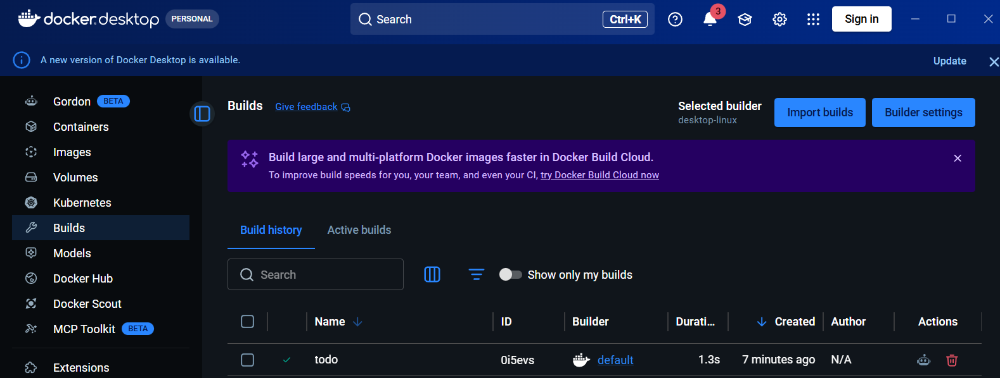
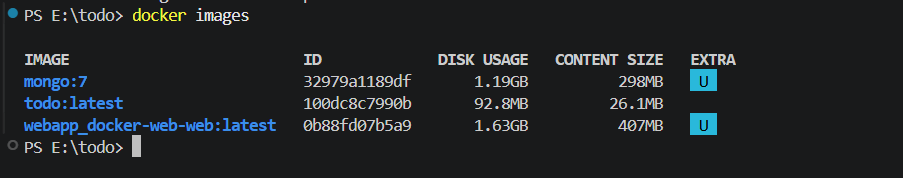
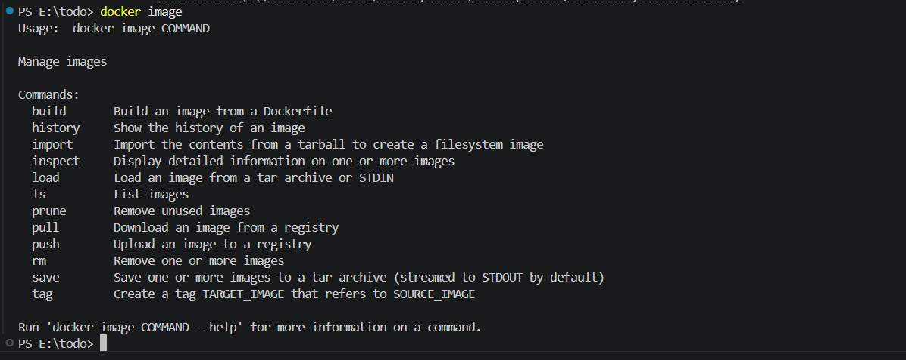
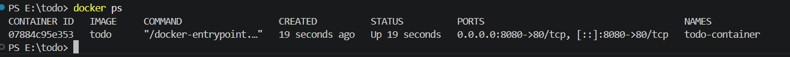
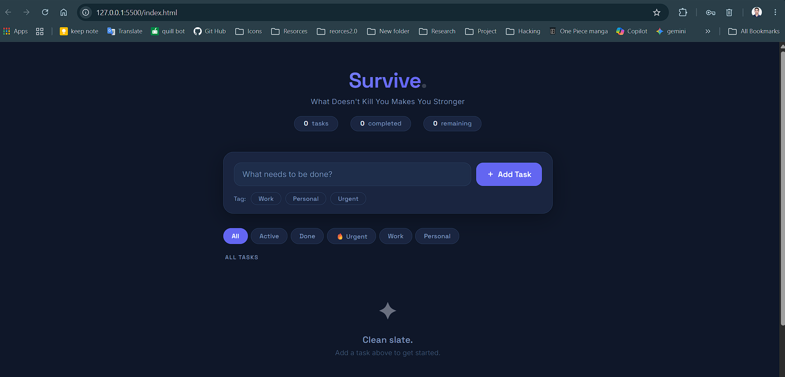

# Survive - To-Do Application

## Project Overview

This project is a simple To-Do Application developed as part of the Cloud Computing Sessional Lab. The application allows users to manage daily tasks through a clean web interface. Users can add, view, and delete tasks directly from the browser.

The application is containerized using Docker and deployed inside an Nginx web server container.

---

## Features

* Add new tasks
* View existing tasks
* Delete completed tasks
* Responsive web interface
* Dockerized deployment

---

## Technologies Used

* HTML
* Docker
* Nginx

---

## Project Structure

```text
todo/
│
├── index.html
├── Dockerfile
└── README.md
```

---

## Docker Setup

### Step 1: Create Dockerfile

A Dockerfile was created using the Nginx Alpine image as the base image.

```dockerfile
FROM nginx:alpine

COPY . /usr/share/nginx/html/

EXPOSE 80
```


---

### Step 2: Build Docker Image

The Docker image was built using the following command:

```bash
docker build -t todo-app .
```


---

### Step 3: Verify Docker Image

```bash
docker images
```

This command displays the created Docker image.


---

### Step 4: Run Docker Container

```bash
docker run -d -p 8080:80 --name todo-container todo-app
```

This command starts a Docker container and maps port 8080 on the host machine to port 80 inside the container.


---

### Step 5: Verify Running Container

```bash
docker ps
```


This command displays all active containers.

---

### Step 6: Access the Application

Open a web browser and visit:

```text
http://localhost:8080
```


The To-Do Application will be available through the browser.

---

## Docker Commands Used

```bash
docker build -t todo-app .
docker images
docker run -d -p 8080:80 --name todo-container todo-app
docker ps
docker stop todo-container
docker start todo-container
docker rm -f todo-container
```

---

## Discussion

Docker simplifies application deployment by packaging the application and its runtime environment into a portable container. This ensures consistent behavior across different systems and eliminates dependency-related issues. By using Docker, the To-Do application can be deployed quickly and reliably on any machine that supports Docker.

---

## Conclusion

A simple To-Do Application was successfully developed and deployed using Docker. The project demonstrates the basic concepts of containerization, image creation, container execution, and web application deployment using Docker and Nginx.
